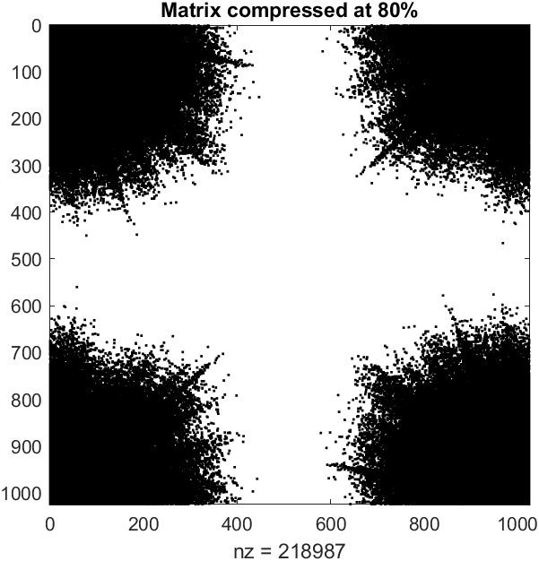
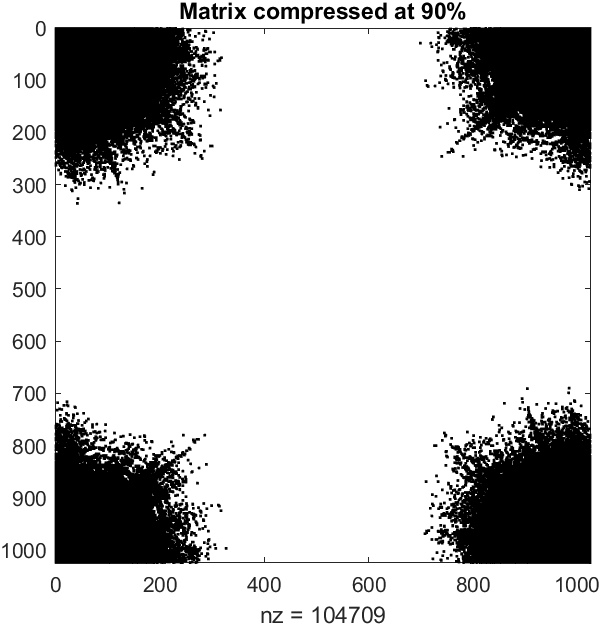
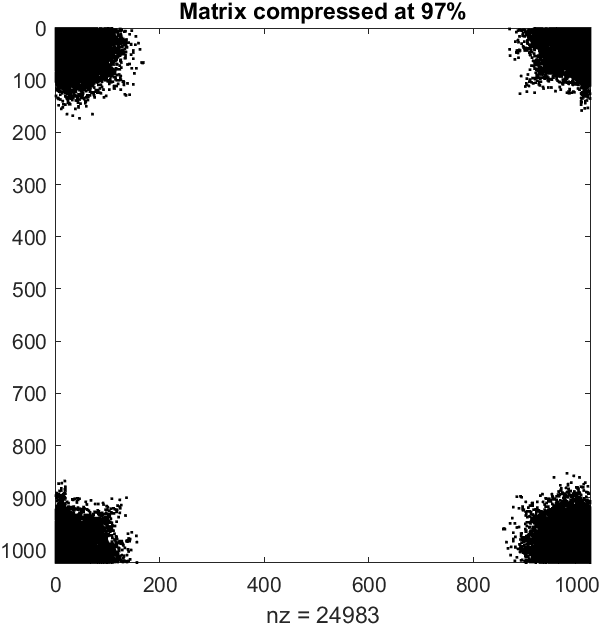

# FAST FOURIER TRASFORM
## Authors

- Pasquini Pietro
- Miani Giorgio

## **INTRODUCTION**
Here there is a little summarize of our work for the implementation of the **Fast Fourier Trasform**. This Repo includes two folders, one for the 1 dimension FFT, and another one for the 2 dimensions FFT.
Here below there is a recap of the various files and classes in the folders.

## **FFT_1D**
The folder includes a cpp file containing the class that implements the FFT in 1 dimension, an header file for this class and a main file for testing.
In the class called FFT_1D we have different functions and variables to deal with the serial implementation and the parallel one.
Here there's a list of the main ones:

### **Discrete solve**
This fuction takes a vector from the input and implements the discrete fourier trasform on it. It is only use for testing the solution for small input since it's computational cost is high.

### **Iterative solve**
Here there's an iterative implemantion of the fast fourier trasform based on the **Cooley-Tuck** algorithm. It is perfomed on a vector saved on the **input** protected variable, and the result it's saved in the **iterative_solution** variable.
This fuction is mainly used to compare the time taken by the serial algorithm, with the time taken by the parallel one.

### **Parallel solve**
This is the parallel implementation of the **Cooley-Tuck** algorithm for the FFT. The function uses **MPI**** to scatter the input in smaller vectors and distribute them between the processors of the computer. On every local vector it performs the iterative FFT and then gathers the result in the **parallel_solution** variable.
With large-size vectors it performs better then the serial implementation. 

### **Inverse_solve** 
Performs the inverse FFT on a given vector and returns the result.

### **Output and test** and **Evaluate time and error**
This two final functions are mainly used to test our algorithm. **Output_and_test** compares the result of the parallel algorithm with the result of the discrete fourier trasform (It shoul be used only with small input due to the computational cost). While the **Evaluate_time_adn_error** calls the iterative solves and compares the time taken by the two algorithms and then it computes the inverse fft on the parallel solution and compares it with the initial input by calculating the error as:
```
 Error = max(|input[i] - parallel_solution[i]|) per ogni i = 0 ,... ,n
```


### **Compilation**
Finally to compile the code enter just
```
make FFT
```
and then to run it with a random input of dimension 2^N enter:
```
mpiexec -n [number_of_processors] ./FFT random [N]
```
while to run in with a given input from a text file (Warning: dimension must be a power of 2) enter:
```
mpiexec -n [number_of_processors] ./FFT [path_of_input]
```


## **FFT_2D**
In this folder there are the files for the implementation of the class for the FFT in 2 dimensions. In this case we decided to use the **Eigen** library in order to deal in an efficient way with matrixes. Here there's the library documentation: https://eigen.tuxfamily.org/dox/, in order to work the eigen module should be installed on the device.
The structure of the folder is similar to the one for the 1 dimension fft, since there is an header file for the class, a file containing its implemantation and the main file where the class is created and tested. Most functions uses the function created for the 1D FFT, but are changed in order to work with Eigen matrixes, such as **iterative_solve_wrapped** and **parallel_solve_wrapped**.
Here below there's a little summary of the new functions created:

### **iterative_solve**
This functions simply iterates the serial FFT on every row first, and then on every column of the input matrix in order to perform the 2 dimensional FFT.

### **parallel_solve**
The implementation of this function is very similar to the one of the **iterative_solve** with the difference that the fft is done in parallel on the rows and on the columns of thi matrix, using **OPENMP*** and a variable number of threads.

### **inverse_fft**
This function is very similar to the **iterative_solve** except that it perfoms the inverse FFT instead of the standard one on every row and column of the matrix in the **parallel_solution** variable, and then saves the result in **inverse_solution**.

### **Evaluate time and error**
This function calls the iterative solver and compares the time taken by the two algorithms, plus it also computes the inverse FFT 2D on the parallel solution and compares it with the initial input by calculating the error as
```
 Error = max(|input(i, j) - parallel_solution(i, j)|) per ogni i, j = 0 ,... ,n
```

### **Compilation**
For the compilation, first run
```
make FFT
```
and then to run it with a random input of dimension 2^N enter:
```
./FFT [number_of_threads_used] random [N]
```
while to run in with a given input from a text file (Warning: dimension must be a power of 2) enter:
```
./FFT [number_of_threads_used] [path_of_input]
```


## **IMAGE_COMPRESSION**
And then at last we implemented the image compression. The class allows to load a png image using the **load_image** function, perform a compression usign the 2D FFT and a quantization function and then saves the result as a Sparse compressed matrix in the **Matrix_compressed** file. The class also allows to decompress (inverse 2D FFT plus dequantization) the image starting from the compressed file and saves it as **output.png** in the same folder.
Here below there is a summary of the main fuction used for the compression and decompression.

### **image_compression**
This function takes the input matrix and performs first the 2D FFT and then compresses the result by calling the quantization function. It then calculates the number of zero elements in the matrix before and after the compression, displays the results and the memory saved and then finally saves the matrix as Sparse and stores it in the **matrix_compressed** file. Moreover it returns the compression factor calculated by the quantization function.

### **quantization**
The quantization basically takes all the matrix parameters and saves only the high frequency, while the low ones are set to zero. To get the high frequency it calculates a compression factor using the mean of the absolute values of the parameters multiplied by the **compression** parameter given as input on the command line; this parameter should go from 0.5 for a low compression, to 1.0 to an higher one. The matrix parameters are then divided by this compression factor, in this way all low frequency will be less then one. The function finally calculates the absolute value of the matrix parameters and sets to zero if they are less then 1.0 (low frequency) in order to get as much zero entries as possible to save memory.

### **decompression**
This function is the inverse of the **image_compression**, it basically performs a dequantization, then it computes the inverse 2D FFT on the result and finally it saves the image in the **outpu.png** file.

### **dequantization**
The dequantization simply multiplies every matrix parameter by the compression_factor given by input;

### **image_compression_rgb** and **image_decompression_rgb**
We also added two functions to compress colored png images, this functions operates in the same way for  black and white images, with the difference that they will iterate over 3 channels of colors(red-green-blue) instead of  just one.

### **load_compression** and **load_image**
The first function(**load_compression**) is useful to load the compressed matrix from the file so it can be decompressed afterwards, while the second one(**load_image**) can be used to load an image from a given file and of a given dimension, both passed by command line.

### **Compilation**
To run and compile the code, first run 
```
make compression
```
followed by
```
./compression [number_of_threads_used] [file_path_input_image] [image_dimension] [compression_desired] [color]
```
where color can be either **bk** for a black image compression, or **rgb** for a colored one (**rgb** by default).

### **Results**
Here below is shown how the compression performs for a black and white image. It is shown how the matrix sparsity pattern increases, as the compression increases too, but the quality of the image decreases at the same time.

  

  

  


